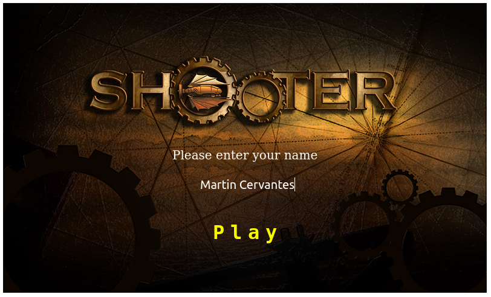
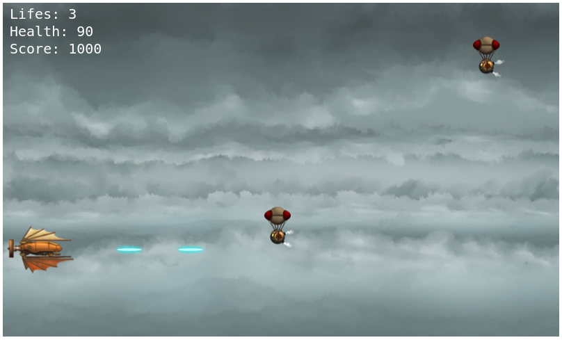

# VideoGame JS
This project consists of building a video game using JavaScript (ES6) and the Phaser game engine. An encapsulation in modules was carried out through Webpack. Player scores are tracked and sent to the Leaderboard API. And finally, the test of some units was carried out using Jest.






## :package: Built With

- Javascript (ES6)
- Phaser
- Webpack
- Jest

## :mag: Live Demo

[Live Demo Link](https://videogame-js.netlify.app/)

## :computer: Getting Started

To get a local copy up and running follow these simple steps.


### Download

1) Clone the repository to your local machine

```sh
  $ git clone https://github.com/mcervantes71/VideoGame_JS.git
```

2) cd into the directory

```sh
  $ cd VideoGame_JS
```

### Requirements

[Node.js](https://nodejs.org) is required to install dependencies and run scripts via `npm`.

### Usage

Install the dependencies in the local node_modules folder

```sh
  $ npm install
```

Build project and open web server running project

```sh
  $ npm start
```

Builds code bundle with production settings (minification, uglification, etc..)

```sh
  $ npm run build
```

Run testing cases and Jest will print messages depending on the result

```sh
  $ npm run test
```

## :busts_in_silhouette: Authors

👤 **Martin Cervantes**

- Linkedin: [Martin Cervantes](https://www.linkedin.com/in/cervantesmartin/)
- Twitter: [@M4rt1nC3rv4nt3s](https://twitter.com/M4rt1nC3rv4nt3s)
- Github: [@mcervantes71](https://github.com/mcervantes71)
- Gmail: [cervantes.martine](mailto:cervantes.martine@gmail.com)

## 🤝 Contributing

    Contributions, issues and feature requests are welcome!

Feel free to check the [issues page](../../issues).

## :star2: Show your support

    Give a ⭐️ if you like this project!

## 📝 License

This project is [MIT](lic.url) licensed.
